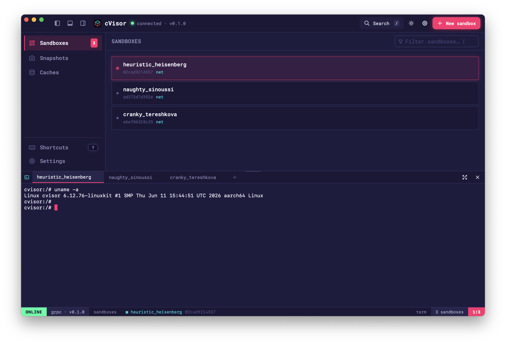

# cVisor — an in-process Linux sandbox for untrusted & LLM-generated code
[](https://github.com/tsirysndr/bVisor/actions/workflows/ci.yml)

cVisor safely runs untrusted or LLM-generated code — no VM, no container. Inspired
by [gVisor](https://github.com/google/gVisor), it isolates programs by intercepting
and virtualizing [Linux syscalls](https://en.wikipedia.org/wiki/System_call) from
userspace ([seccomp user-notifier](https://man7.org/linux/man-pages/man2/seccomp.2.html)),
spinning up a sandbox in **~2 ms** — ideal for the ephemeral tasks agents run, like
code execution and filesystem operations.

Unlike gVisor, cVisor runs **in-process**. Use it three ways: embed it via a **CLI**
and **11-language SDKs**, or run it as a **daemon** (`cvisord`) exposing the full
runtime over **gRPC + GraphQL** with a **web & desktop UI** — so you can drive Linux
sandboxes from any host, macOS included.

**Status**: past proof-of-concept and moving fast, but still pre-1.0 — not yet
recommended for production. If cVisor's behavior diverges from the Linux kernel,
please file an issue.

**Compatibility**: the sandbox **runtime** is Linux-only (ARM & x86, glibc & musl).
**Clients aren't** — every SDK, the CLI's `--remote` mode, and the web UI can drive a
remote `cvisord` over gRPC/GraphQL from **any OS, including macOS**.

> **Note**: cVisor is a fork of [bVisor](https://github.com/butter-dot-dev/bVisor),
> rewritten in **Rust** (the original is written in Zig).

## Table of Contents

- [Features](#features)
- [Quick try](#quick-try)
- [Usage](#usage)
- [Command-line](#command-line)
  - [Install](#install)
  - [Docker](#docker)
  - [Nix](#nix)
- [Daemon (`cvisord`)](#daemon-cvisord)
- [Web & desktop UI](#web--desktop-ui)
- [SDKs](#sdks)
- [Examples](#examples)
- [Architecture](#architecture)
- [Syscall Support](#syscall-support)
- [Development Guide](#development-guide)

## Features

- **Fast, in-process isolation** — a seccomp user-notifier virtualizes syscalls;
  sandboxes start in ~2 ms with no VM or container, and unsandboxed syscalls run
  natively.
- **Virtualized filesystem** — a copy-on-write overlay per sandbox (tombstones,
  symlinks, virtual `/proc`); read/write/copy files and whole directory trees in
  and out (`.gitignore`/`.dockerignore`-aware).
- **Resource limits & policy** — cgroup v2 memory / pids / CPU caps, a per-run
  timeout, an outbound-network kill switch, opt-in inbound `listen`, and guest
  env vars.
- **Snapshots** — capture a sandbox's filesystem, **branch** a fresh sandbox from a
  snapshot, or **roll back** to one.
- **Directory cache** — keyed backup/restore (gzip / estargz / zstd / none) to the
  host disk or **S3**.
- **Sessions & PTY** — stream a command's output, or run an interactive shell with
  job control and `isatty`.
- **`cvisor` CLI** — run a command, drop into a sandboxed shell, `cp`, `cache`,
  `snapshot`/`branch`/`rollback`, `doctor`; `--remote` drives a daemon; `cvisor ui`
  serves the embedded web UI.
- **`cvisord` daemon** — gRPC + GraphQL over one runtime, guarded by a bearer token
  (with anonymous reflection/introspection); a sandbox registry with Docker-style
  names, plus **SQLite persistence** (FTS5 + pagination) so sandboxes survive
  restarts.
- **Web & desktop UI** — a React app (terminal, command palette, synthwave theme);
  the web build talks GraphQL, the Tauri desktop app talks gRPC.
- **11-language SDKs** — Node/Bun/Deno, Python, Ruby, Erlang, Elixir, Gleam,
  Clojure, Go, Rust, Scala: native FFI on Linux, a GraphQL client to a daemon on
  any OS.
- **Ships everywhere** — static binaries, Alpine / Debian / Ubuntu Docker images,
  and a Nix flake.

## Quick try

Drop into a Python REPL with cvisor installed, from any machine with Docker:

```bash
docker run -it --rm \
  --security-opt seccomp=unconfined --security-opt apparmor=unconfined \
  ghcr.io/astral-sh/uv:python3.12-alpine \
  uv run --with cvisor python
```

```python
>>> from cvisor import Sandbox
>>> sb = Sandbox()
>>> print(sb.run("echo hi; uname -n").stdout)
hi
cvisor
```

The `--security-opt` flags are required: cVisor installs its own seccomp
filter, which Docker's default profiles block.

## Usage

The cVisor runtime ships wrapped in a Typescript SDK, installed via npm.

```bash
npm install @cvisor/sdk
```

Example usage:
```typescript
import { Sandbox } from "@cvisor/sdk";

const sb = new Sandbox();
const output = sb.runCmd("echo 'Hello, world!'");

console.log(await output.stdout());
```

This executes `echo 'Hello, world!'` inside a sandbox.

Filesystem operations are safely virtualized:
```typescript
sb.runCmd("echo 'Hello, world!' > /tmp/test.txt"); // only visible from this sandbox
```

Unsafe commands are blocked:
```typescript
sb.runCmd("chroot /tmp"); // error
```

SDKs for **11 languages** (Python, Ruby, Erlang, Elixir, Gleam, Clojure, Go,
Rust, Scala, plus Bun/Deno alongside Node) are published — and each can also drive a
remote daemon over GraphQL from any OS, macOS included. See the
[SDKs](#sdks) section and [sdks/README.md](sdks/README.md).

## Command-line

The `cvisor` binary runs a command in the sandbox, drops you into an interactive
sandboxed shell, or copies files in and out:

```bash
cvisor -- uname -a                                # run a command, streaming its output
cvisor                                            # interactive shell (bash if present) on a PTY
cvisor -e FOO=bar -e TOKEN=xyz -- printenv FOO    # pass environment variables
cvisor --no-network -- ...                        # deny outbound networking
cvisor --allow-listen -- ...                      # permit inbound TCP servers
cvisor --timeout 5000 -- ...                      # SIGKILL the guest after 5s

# Named, persistent sandboxes + file/dir transfer (survive across invocations):
cvisor --sandbox dev cp ./src sb:/app              # host -> sandbox (recursive)
cvisor --sandbox dev -- python3 /app/main.py       # run against the copied files
cvisor --sandbox dev cp sb:/app/dist ./dist        # sandbox -> host (recursive)

# Cache a directory (backup/restore, keyed) — for build caches, deps, etc.:
cvisor --sandbox dev cache save deps-v1 sb:/app/node_modules
cvisor --sandbox ci  cache restore deps-v1 sb:/app/node_modules   # exact or prefix hit
cvisor cache ls                    # list cached archives
cvisor cache rm deps-v1            # remove one, or `cache rm --all`

# Check the host can run the sandbox:
cvisor doctor
```

It exits with the guest's exit code. With no `--` command and a terminal on
stdin, it starts an interactive shell (`isatty`, job control, and line editing
all work); otherwise it runs a shell reading stdin. In `cp`/`cache`, prefix the
sandbox side with `sb:`. Without `--sandbox`, runs are ephemeral; `--sandbox
<name>` gives a persistent overlay so copied, written, and restored files
persist.

`cp` and `cache save` are recursive and skip paths matched by `.gitignore` /
`.dockerignore`. `cache` archives to the host disk by default (or
`--cache-backend s3://bucket/prefix`) as gzip (default), `--format estargz`,
`zstd`, or `none`; `cache restore <KEY>` takes an exact key or falls back to the
newest archive with that key prefix. The distributed binaries built by CI enable
all formats and the S3 backend.

### Install

```bash
npm install -g @cvisor/cli        # the cvisor CLI
npm install -g @cvisor/daemon     # cvisord, the daemon (Linux only)

npx @cvisor/cli -- echo hello     # or run the CLI without installing
```

npm picks the prebuilt package for your host:

| Host                | Package                    | Binaries            |
| ------------------- | -------------------------- | ------------------- |
| Linux x86_64        | `@cvisor/cli-linux-x64`    | `cvisor`, `cvisord` |
| Linux aarch64       | `@cvisor/cli-linux-arm64`  | `cvisor`, `cvisord` |
| macOS Apple silicon | `@cvisor/cli-darwin-arm64` | `cvisor`            |

The same binaries ship as `cvisor-<os>-<arch>.tar.gz` on each
[GitHub Release](https://github.com/tsirysndr/cVisor/releases) (tag `v*`); the
Linux ones are static musl builds, so they run on any distro.

### Docker

A prebuilt Alpine image (all features — every archive format and the S3 cache
backend) is published to GHCR. cVisor installs its own seccomp filter, so run
with the default profile disabled:

```bash
docker run --rm -it --security-opt seccomp=unconfined ghcr.io/tsirysndr/cvisor           # interactive shell
docker run --rm --security-opt seccomp=unconfined ghcr.io/tsirysndr/cvisor -- uname -a    # run a command
```

Or build it yourself from the repo `Dockerfile` (`docker build -t cvisor .`).

### Nix

A [crane](https://github.com/ipetkov/crane)-based flake builds the CLI (all
features) for `x86_64-linux` and `aarch64-linux`. With flakes enabled:

```bash
nix run    github:tsirysndr/cVisor               # run without installing
nix build  github:tsirysndr/cVisor#cvisor        # build -> ./result/bin/cvisor
nix profile install github:tsirysndr/cVisor      # install into your profile
nix develop github:tsirysndr/cVisor              # dev shell (rust toolchain + tools)
```

(If flakes aren't on yet, add `--extra-experimental-features 'nix-command flakes'`
to each command, or enable them in `nix.conf`.)

#### Speed it up with Cachix

The flake builds the full feature set (zstd + the S3 cache backend), which pulls
in C dependencies (`ring`, `zstd-sys`) — a cold build compiles a lot. The
project pushes prebuilt store paths to a public [Cachix](https://cachix.org)
cache, so pointing Nix at it turns the "build" into a download:

```bash
# one-time: install the cachix client and trust the cvisor cache
nix profile install nixpkgs#cachix
cachix use cvisor

# now builds/runs pull prebuilt paths instead of compiling
nix run github:tsirysndr/cVisor -- uname -a
```

`cachix use cvisor` adds the cache as a substituter and its public key to your
Nix config. Alternatively, add it to `nix.conf` (or a flake `nixConfig`) by hand:

```
extra-substituters = https://cvisor.cachix.org
extra-trusted-public-keys = cvisor.cachix.org-1:<key shown by `cachix use cvisor`>
```

## Daemon (`cvisord`)

Run cVisor as a network service: `cvisord` exposes the full runtime over gRPC
(`:50051`) and GraphQL (`:8080`), guarded by a bearer token (`CVISOR_TOKEN`, else
auto-generated and printed at startup). Sandboxes get Docker-style ids/names and
persist in SQLite (with FTS5 search + pagination) across restarts.

```bash
docker run --rm --security-opt seccomp=unconfined \
  -p 50051:50051 -p 8080:8080 -e CVISOR_TOKEN=change-me \
  --entrypoint cvisord ghcr.io/tsirysndr/cvisor
```

Then drive it from the CLI or any SDK:

```bash
cvisor --remote localhost:50051 --token change-me -- uname -a   # gRPC client
# GraphQL at http://localhost:8080/graphql
```

gRPC reflection and GraphQL introspection are open (anonymous) so tools like
`grpcurl` / GraphiQL can discover the schema; every actual operation requires the
token. See [crates/cvisor-daemon](crates/cvisor-daemon).

## Web & desktop UI

`cvisor ui` serves an embedded React web app — sandbox list, a live terminal,
snapshots/caches, and a `/` command palette — that talks to a daemon over GraphQL:

```bash
cvisor ui --daemon http://localhost:8080 --token change-me
```

A Tauri desktop build of the same app talks to the daemon over gRPC instead. See
[ui/](ui).

## SDKs

cVisor ships SDKs in **11 languages** — Node/Bun/Deno, Python, Ruby, Erlang,
Elixir, Gleam, Clojure, Go, Rust, and Scala. On Linux they wrap the native runtime
(FFI/NIF over `libcvisor`); on any OS — **macOS included** — they also expose a
GraphQL client and a `RemoteSandbox` that drives a `cvisord` daemon. See
[sdks/README.md](sdks/README.md).

## Examples

Here are a selection of full examples which currently work in cVisor:
- [Hello World](sdks/node/examples/hello-world.ts) - Run your first command in the sandbox
- [Running Python](sdks/node/examples/python-hello.ts) - Write and execute a Python script 
- [Testing Sandbox Boundaries](sdks/node/examples/sandbox-boundaries.ts) - See how the sandbox handles host fingerprinting, blocked paths, and filesystem isolation
- [Filesystem Operations](sdks/node/examples/nested-dirs.ts) - Demonstrate directory creation, file operations, running scripts

## Architecture

cVisor is built on [Seccomp user notifier](https://man7.org/linux/man-pages/man2/seccomp.2.html), a Linux kernel feature that allows userspace processes to intercept and optionally handle syscalls from a child process. This allows cVisor to block or mock the kernel API (such as filesystem read/write, network access, etc.) to ensure the child process remains sandboxed.

Other than the overhead of syscall emulation, child processes run natively.

cVisor is imageless, meaning it does not require a base image to run. It runs with direct visibility to the host filesystem. This allows system dependencies such as `npm` to work out of the box. Isolation is achieved via a copy-on-write overlay on top of the host filesystem. Files opened with write flags are copied to a sandbox-local directory. Read-only files are passed through to the real filesystem.

## Syscall Support

Every Linux syscall falls into one of four categories in cVisor:

#### Virtualized
Syscalls are intercepted and handled in userspace by the cVisor virtual kernel.

| | Syscalls |
|-|----------|
| File I/O | `openat`, `close`, `read`, `write`, `readv`, `writev`, `lseek`, `dup`, `dup3`, `fcntl`, `ioctl`, `pipe2` |
| File metadata | `fstat`, `fstatat64`, `faccessat`, `utimensat`, `fchmodat` |
| Directory | `getcwd`, `chdir`, `fchdir`, `getdents64`, `mkdirat`, `unlinkat`, `symlinkat`, `readlinkat` |
| Process | `getpid`, `getppid`, `gettid`, `kill`, `tkill`, `exit`, `exit_group`, `execve` |
| Networking | `socket`, `socketpair`, `connect`, `shutdown`, `sendto`, `recvfrom`, `sendmsg`, `recvmsg` |
| System info | `uname`, `sysinfo` |
| Events | `eventfd2` |

Note that cVisor may still call into the underlying kernel to virtualize any given syscall.

#### Passthrough
Syscalls are forwarded to the kernel unmodified. These syscalls are process-local or read-only and do not require any virtualization.

| | Syscalls |
|-|----------|
| Process | `clone`, `wait4`, `waitid`, `set_tid_address` |
| Identity | `getuid`, `geteuid`, `getgid`, `getegid` |
| Memory | `brk`, `mmap`, `mprotect`, `munmap`, `mremap`, `madvise` |
| Signals | `rt_sigaction`, `rt_sigprocmask`, `rt_sigreturn`, `rt_sigsuspend`, `rt_sigpending`, `rt_sigtimedwait`, `sigaltstack`, `restart_syscall` |
| Time | `clock_gettime`, `clock_getres`, `gettimeofday`, `nanosleep`, `clock_nanosleep` |
| Sync | `futex`, `futex_wait`, `futex_wake`, `futex_requeue`, `futex_waitv`, `set_robust_list`, `rseq` |
| Random | `getrandom` |

#### Blocked
Syscalls are blocked and return `ENOSYS` or `EPERM`. These could allow sandbox escape or privilege escalation.

| | Syscalls |
|-|----------|
| Privilege escalation | `ptrace`, `mount`, `umount2`, `chroot`, `pivot_root`, `reboot`, `setns`, `unshare`, `seccomp`, `bpf` |
| Cross-process memory | `process_vm_readv`, `process_vm_writev` |
| Kernel modules | `kexec_load`, `kexec_file_load`, `init_module`, `finit_module`, `delete_module` |
| Resource control | `setrlimit`, `prlimit64` |
| Execution domain | `personality` |
| Server sockets | `bind`, `listen`, `accept`, `accept4` |

#### Roadmap
Not yet handled but likely necessary for Bash compatibility. Currently return `ENOSYS`.

| | Syscalls |
|-|----------|
| System info | `getrlimit`, `getrusage` |
| Resource limits | not started (cgroups) |

<details>
<summary>See full list of other unhandled syscalls (~240)</summary>

| | Syscalls |
|-|----------|
| File I/O | `pread64`, `pwrite64`, `preadv`, `pwritev`, `preadv2`, `pwritev2`, `sendfile`, `splice`, `tee`, `vmsplice`, `readahead`, `copy_file_range` |
| File metadata | `statx`, `statfs`, `fstatfs`, `truncate`, `ftruncate`, `fallocate`, `fadvise64`, `flock`, `fchmod`, `fchmodat2`, `fchown`, `fchownat`, `faccessat2`, `cachestat` |
| Directory | `mknodat`, `linkat`, `renameat`, `renameat2` |
| Process | `execveat`, `clone3`, `tgkill`, `prctl`, `pidfd_open`, `pidfd_getfd`, `pidfd_send_signal`, `kcmp`, `userfaultfd` |
| System info | `syslog`, `umask`, `getcpu`, `acct`, `vhangup`, `sethostname`, `setdomainname` |
| Identity (write) | `setuid`, `setgid`, `setreuid`, `setregid`, `setresuid`, `getresuid`, `setresgid`, `getresgid`, `setfsuid`, `setfsgid`, `getgroups`, `setgroups`, `setpriority`, `getpriority` |
| Session/pgid | `setpgid`, `getpgid`, `getsid`, `setsid` |
| Memory | `msync`, `mlock`, `munlock`, `mlockall`, `munlockall`, `mincore`, `remap_file_pages`, `mbind`, `get_mempolicy`, `set_mempolicy`, `set_mempolicy_home_node`, `migrate_pages`, `move_pages`, `process_madvise`, `mlock2`, `memfd_create`, `memfd_secret`, `map_shadow_stack`, `pkey_mprotect`, `pkey_alloc`, `pkey_free`, `mseal`, `membarrier`, `process_mrelease` |
| Signals | `rt_sigqueueinfo`, `rt_tgsigqueueinfo`, `signalfd4` |
| Time | `clock_settime`, `clock_adjtime`, `settimeofday`, `adjtimex`, `getitimer`, `setitimer`, `times`, `timer_create`, `timer_gettime`, `timer_getoverrun`, `timer_settime`, `timer_delete`, `timerfd_create`, `timerfd_settime`, `timerfd_gettime` |
| Networking | `getsockname`, `getpeername`, `setsockopt`, `getsockopt`, `sendmmsg`, `recvmmsg` |
| Polling/events | `epoll_create1`, `epoll_ctl`, `epoll_pwait`, `epoll_pwait2`, `pselect6`, `ppoll` |
| File sync | `sync`, `fsync`, `fdatasync`, `sync_file_range`, `syncfs` |
| File handles | `name_to_handle_at`, `open_by_handle_at`, `openat2`, `close_range` |
| Async I/O | `io_setup`, `io_destroy`, `io_submit`, `io_cancel`, `io_getevents`, `io_pgetevents`, `io_uring_setup`, `io_uring_enter`, `io_uring_register` |
| IPC | `mq_open`, `mq_unlink`, `mq_timedsend`, `mq_timedreceive`, `mq_notify`, `mq_getsetattr`, `msgget`, `msgctl`, `msgrcv`, `msgsnd`, `semget`, `semctl`, `semtimedop`, `semop`, `shmget`, `shmctl`, `shmat`, `shmdt` |
| Extended attributes | `setxattr`, `lsetxattr`, `fsetxattr`, `getxattr`, `lgetxattr`, `fgetxattr`, `listxattr`, `llistxattr`, `flistxattr`, `removexattr`, `lremovexattr`, `fremovexattr`, `setxattrat`, `getxattrat`, `listxattrat`, `removexattrat` |
| Scheduling | `sched_setparam`, `sched_setscheduler`, `sched_getscheduler`, `sched_getparam`, `sched_setaffinity`, `sched_getaffinity`, `sched_yield`, `sched_get_priority_max`, `sched_get_priority_min`, `sched_rr_get_interval`, `sched_setattr`, `sched_getattr` |
| Capabilities | `capget`, `capset` |
| Mount/namespace | `mount_setattr`, `move_mount`, `fsopen`, `fsconfig`, `fsmount`, `fspick`, `open_tree`, `open_tree_attr`, `statmount`, `listmount` |
| Security | `landlock_create_ruleset`, `landlock_add_rule`, `landlock_restrict_self`, `lsm_get_self_attr`, `lsm_set_self_attr`, `lsm_list_modules` |
| Keys | `add_key`, `request_key`, `keyctl` |
| Inotify/fanotify | `inotify_init1`, `inotify_add_watch`, `inotify_rm_watch`, `fanotify_init`, `fanotify_mark` |
| I/O priority | `ioprio_set`, `ioprio_get` |
| Swap | `swapon`, `swapoff` |
| Misc | `nfsservctl`, `quotactl`, `quotactl_fd`, `lookup_dcookie`, `perf_event_open`, `get_robust_list`, `file_getattr`, `file_setattr` |

</details>

## Development Guide

#### Rust

cVisor is written in **Rust** (a Cargo workspace under `crates/`). It depends on
Linux kernel features but is developed primarily on ARM Macs; cross-compilation
uses [`cargo-zigbuild`](https://github.com/rust-cross/cargo-zigbuild), and all
kernel-facing tests run in Docker.

**Requires**: a stable Rust toolchain with the four linux targets, `cargo-zigbuild`, and Docker.

```bash
cargo test -p cvisor-core        # pure-logic unit tests on the host (macOS ok)
cargo xtask test                 # full unit + e2e suite in Alpine (Docker, cross-compiled musl)
cargo xtask run                  # E2E smoke scorecard in the sandbox in Docker
cargo xtask ffi                  # build libcvisor.so and distribute it to the FFI SDKs
cargo xtask run-node             # build libcvisor.node + run the Node SDK test.ts in bun
cargo xtask node-artifacts       # build libcvisor.node for all 4 platform packages
```

Build with the `fail-loudly` feature to panic on an unhandled syscall instead of
returning ENOSYS:

```bash
cargo build -p cvisor-core --features fail-loudly
```

See `sdks/README.md` for the language SDKs (Node, Bun, Deno, Python, Ruby, Erlang, Clojure).
